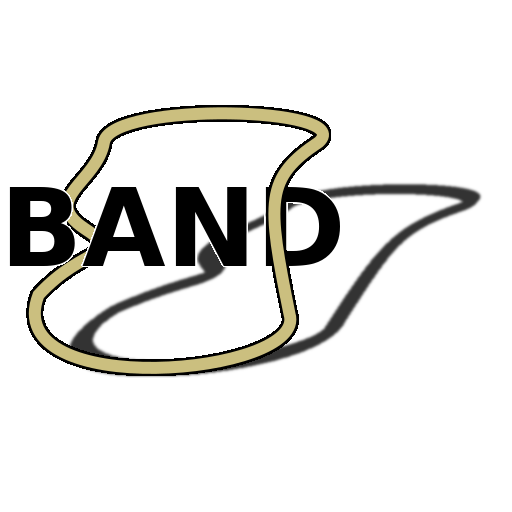

`band` is a c++ media-library.

## Dependencies

* `libtool`: Combining static libraries when building.
* `doxygen`: Documentation generation.

## Building

* `make` in the root-directory builds documentation.
* `make` in the 'band'-dierctory builds `band` into a static-library.
* `make` in the 'example'-directory builds all the examples. A `make clean`
  should be run before if the library itself was actually modified.

## Running

* `cmd/file-to-code/file-to-code` runs a tool which generates a header and
  source file from a normal file.
* `example/bin/simple` runs the simple-example.

## Linking

* Provide the path to the combiled 'band'-directory as an include-path and the
  compiled static-library as a linked-library. Additionally, `dl`, `X11`, and
  `pthread` should be linked. These aren't a dependency for all platforms so
  they are left to the consumer to link. An example can be seen in the
  'Makefile' in the 'example' folder.

## Feature-Requests

* Create a issue with the label 'enchancement'. It will be groomed then sorted
  into a release to be worked on.

## Contributing

* Any task or feature-request can be worked on before being groomed on its own
  branch. If the feature is desired, it will be merged until a release.
